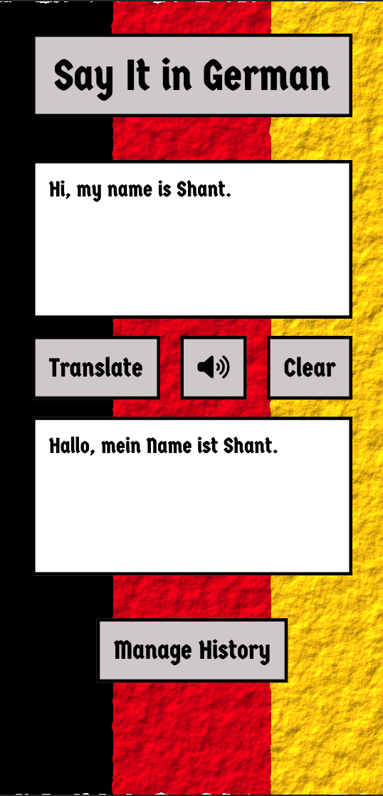
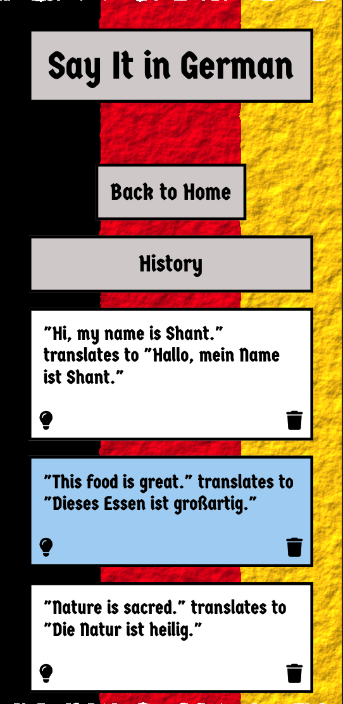

# Say It in German!
A translation app that takes in English text and translates it to German, with the option of speaking it as well. It is built with React, and powered by OpenAI. 

## In This Document:
- [Say It in German!](#say-it-in-german)
  - [In This Document:](#in-this-document)
  - [Live Application URL](#live-application-url)
  - [How to Use the Application](#how-to-use-the-application)
  - [Technologies Used](#technologies-used)
  - [Future Features:](#future-features)
  - [Challenges and Learning Points:](#challenges-and-learning-points)

## Live Application URL
https://sayitingerman.netlify.app/

## How to Use the Application
### Home Page
1. A traveller to Germany opens the app.
2. The traveller writes the phrase in English.
3. The traveller clicks on Translate.
4. The app should show the translation in English.
5. The traveller can click on the Speak button and the app should read the translation.
6. The traveller can click on Clear to clear the input area and start over.
   
### History Page
1. The traveller clicks on Manage History.
2. The History page should open.
3. There the traveller can see past translations, with the most recent at the top.
4. The traveller could highlight a transation to mark it as "revisit".
5. The traveller could delete a translation from history.
6. The traveller could go back to the Home page.

## Technologies Used
1. React.
2. [OpenAI API](https://platform.openai.com/docs/introduction/overview) for the translation.
3. [Eleven Labs API](https://elevenlabs.io/docs/api-reference/text-to-speech) for the TTS (Text to Speech).
4. Progressive Web Apps methodology, using site.webmanifest file and icons.

## Future Features:
1. The traveller can speak English into the app and the app would capture it in writing and do the translation to German automatically. 

## Challenges and Learning Points:
1. I used Figma to design the UI.
2. Originally I used HTML, CSS, and vanilla JS to built the UI. Later I converted the UI to React.
   

[Up](README.md)
