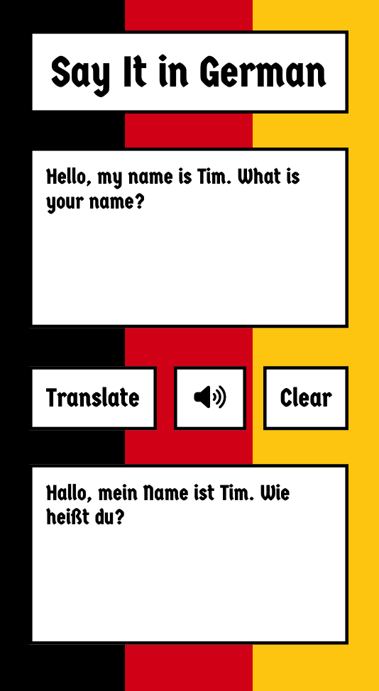

# Say It in German!
A translation app that takes in English text and translates it to German, with the option of speaking it as well. It is build with HTML, CSS, JavaScript, and powered with OpenAI. 

## In This Document:
1. [Live Application URL](#live-application-url)
2. [How to Use the Application](#how-to-use-the-application)
4. [Technologies Used](#technologies-used)
5. [Future Features](#future-features)
6. [Challenges and Learning Points](#challenges-and-learning-points)

## Live Application URL
https://sayitingerman.netlify.app/

## How to Use the Application
1. A traveller to Germany opens the app.
2. The traveller writes the phrase in English.
3. The Traveller clicks on Translate.
4. The app should show the translation in English.
5. The traveller can click on the Speak button and the app should read the translation.
6. The traveller can click on Clear to clear the input area and start over.

## Technologies Used
1. HTML, CSS, and JavaScript.
2. [OpenAI API](https://platform.openai.com/docs/introduction/overview)
3. Progressive Web Apps methodology.

## Future Features:
1. The traveller can speak English into the app and the app would capture it in writing and do the translation to German. 

## Challenges and Learning Points:
1. I used Figma to design the UI.
   

[Up](README.md)
